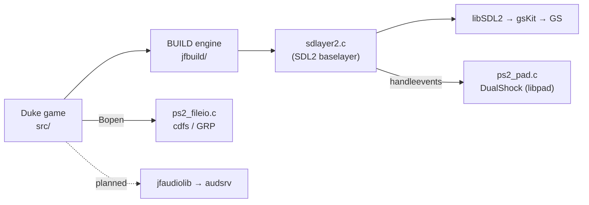

# ps2uke

**Duke Nukem 3D on the PlayStation 2.** A port of
[JFDuke3D](https://github.com/jonof/jfduke3d) (engine + game + input + audio) to
the PS2, built with the [ps2dev](https://github.com/ps2dev/ps2dev) toolchain and
booted from an ISO in PCSX2 or on real hardware.

> **Status (2026-06-12):** boots to the **Duke Nukem 3D main menu** on PS2 —
> cdfs → `DUKE3D.GRP` → palette → ART → `setvideomode` 320×200 → SDL2/gsKit.
> DualShock input works (libpad). **Audio is in progress** (currently silent).



## Build

The toolchain runs in Docker. With the image built (`ps2uke-dock:local`):

```sh
./build.sh                 # make in ps2/  →  ps2/ps2uke.elf
./make_iso.sh [grp-dir]    # stage SYSTEM.CNF + ELF + DUKE3D.GRP + duke3d.cfg
                           #   →  dist/ps2uke.iso
```

Then boot `dist/ps2uke.iso` in PCSX2 or on hardware.

> **Game data is never committed.** `DUKE3D.GRP` (and demos/maps) stay
> copyrighted to 3D Realms; supply your own at ISO-build time. The Atomic 1.5 GRP
> is what's tested.

## Docs

- **[PORTING.md](PORTING.md)** — the architecture map: base choice, the PS2 seam, roadmap.
- **[docs/ARCHITECTURE.md](docs/ARCHITECTURE.md)** — full subsystem deep-dive with Mermaid diagrams (boot, video, input, filesystem, audio, build, EE↔IOP).
- **[progress.md](progress.md)** — dated progress log (incl. the icculus → Chocolate → JFDuke3D history).

## Why JFDuke3D

Earlier attempts on the icculus source (no engine / no `main()`) and Chocolate
Duke3D (dead-ended on a VESA-BIOS palette path that doesn't exist on a PS2)
failed. JFDuke3D's **baselayer** lets the engine own the palette and asks the
platform only to present a finished 8-bit frame — a handoff a console can actually
implement. See [PORTING.md](PORTING.md#why-jfduke3d-and-not-chocolate--icculus).

## License

Duke Nukem 3D source is GPLv2 (3D Realms, 2003); JFDuke3D and its components carry
their respective upstream licenses. The PS2 glue in `ps2/` follows the same terms
as the code it links against.
