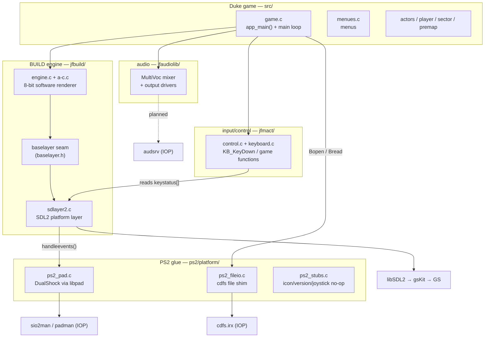
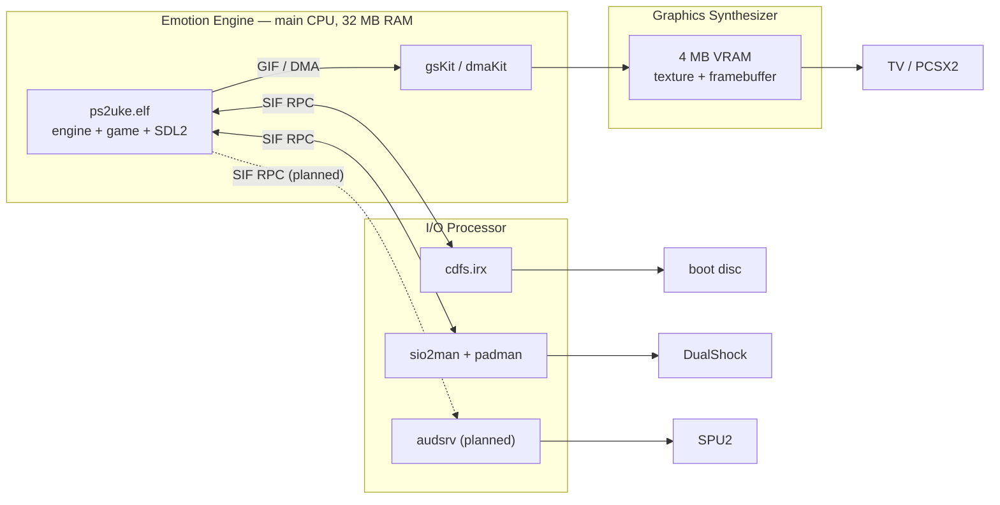
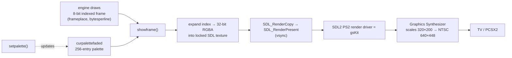
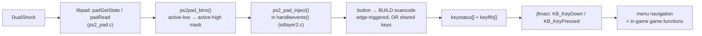
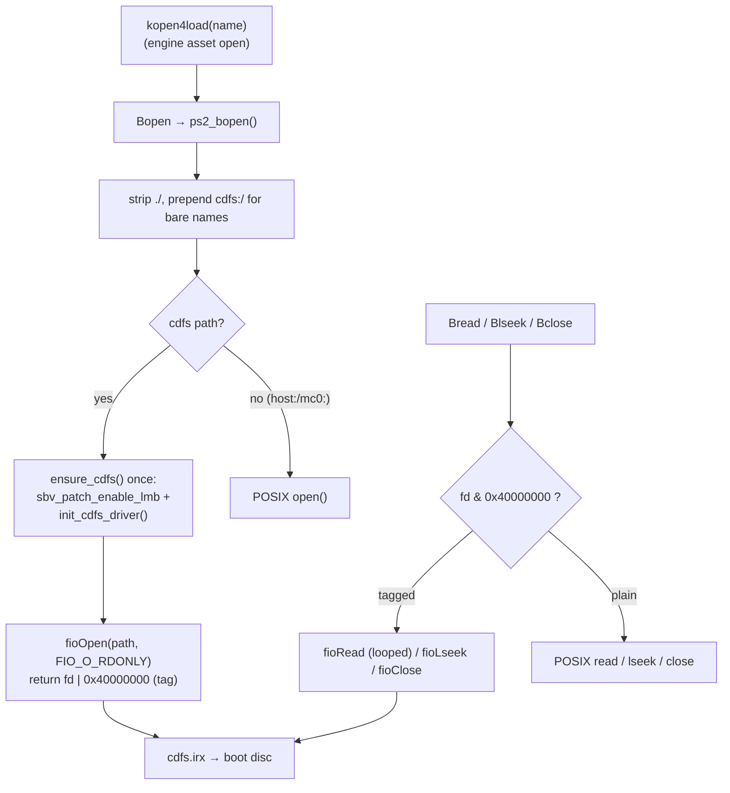
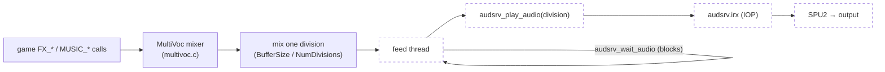
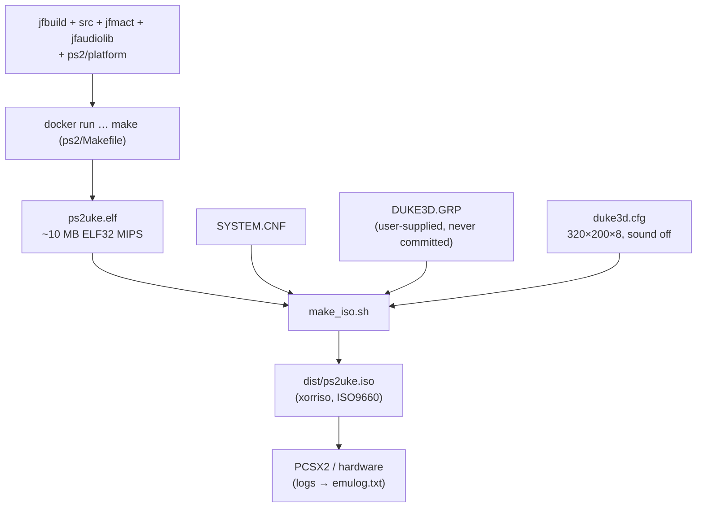

# ps2uke — Architecture

This is the deep-dive companion to [`../PORTING.md`](../PORTING.md). It documents
how the JFDuke3D-on-PlayStation-2 port is wired, subsystem by subsystem, with the
data/control flows drawn out. Everything here is grounded in the actual code; file
and function references are clickable in most editors.

> **Audience:** anyone picking the port up cold. If you only read one diagram,
> read the [Boot sequence](#3-boot-sequence) — it's the spine everything hangs off.

## Table of contents

1. [Overview & module map](#1-overview--module-map)
2. [The two processors (EE / IOP)](#2-the-two-processors-ee--iop)
3. [Boot sequence](#3-boot-sequence)
4. [Video pipeline](#4-video-pipeline)
5. [Input pipeline](#5-input-pipeline)
6. [Filesystem: cdfs & the GRP](#6-filesystem-cdfs--the-grp)
7. [Audio (in progress)](#7-audio-in-progress)
8. [Build & ISO](#8-build--iso)
9. [Hard-won facts / gotchas](#9-hard-won-facts--gotchas)

---

## 1. Overview & module map

ps2uke vendors four upstream trees and adds a thin PS2 glue layer. The engine was
designed to sit behind a **baselayer** seam; the port's job is to implement that
seam (plus filesystem, input and audio) for the console.



| Tree            | Role                                                            | Built as |
|-----------------|----------------------------------------------------------------|----------|
| `jfbuild/`      | BUILD engine + portable **baselayer**; `sdlayer2.c` is the SDL2 seam | software renderer (`USE_POLYMOST=0`, `USE_OPENGL=0`) |
| `src/`          | Duke game logic; `app_main()` in `game.c`                      | game TUs, editor excluded |
| `jfmact/`       | Keyboard/mouse/joystick → game-function mapping                | `control.c`, `keyboard.c`, … |
| `jfaudiolib/`   | Apogee-style MultiVoc mixer + per-OS output drivers            | currently `driver_nosound` |
| `ps2/`          | **Our** Makefile, glue (`platform/`), `duke3d.cfg`, ISO builder | links the ELF |

---

## 2. The two processors (EE / IOP)

A PS2 is two CPUs. The **Emotion Engine (EE)** runs our ELF (engine + game + SDL2)
and drives the **Graphics Synthesizer (GS)** through gsKit. The **I/O Processor
(IOP)** runs small **IRX** modules that own the hardware peripherals; the EE talks
to them over the **SIF** (a DMA + RPC bridge). Getting data on/off the disc, the
pad, and the SPU2 all means an EE→IOP RPC round-trip.



**IRX modules** are loaded from the PS2 ROM (`rom0:SIO2MAN`, `rom0:PADMAN`) or as
buffers embedded in `libps2_drivers` (`cdfs.irx`, `audsrv.irx`). Buffer loading
needs the **SBV patches** enabled first (see boot sequence).

---

## 3. Boot sequence

The single most important wiring decision: **`libSDL2main` owns the entry point.**
Its PS2 `main()` resets the IOP and applies the SBV patches *before* any of our
code, then calls `SDL_main`. We make `sdlayer2.c`'s `main` become that `SDL_main`
with `-Dmain=SDL_main` in the Makefile — otherwise the IOP/SBV bring-up never runs
and `cdfs.irx` fails to register ("Unknown device 'cdfs'").

```mermaid
sequenceDiagram
    autonumber
    participant CRT as crt0 (ELF entry)
    participant MAIN as libSDL2main main()
    participant SDLM as SDL_main = sdlayer2 main()
    participant APP as app_main() — game.c
    participant ST as Startup() — game.c
    participant LOOP as title / menu loop

    CRT->>MAIN: _start
    MAIN->>MAIN: SifInitRpc + IOP reset
    MAIN->>MAIN: sbv_patch_enable_lmb()  (load IRX from EE buffers)
    MAIN->>SDLM: SDL_main(argc, argv)
    SDLM->>SDLM: SDL_Init(VIDEO | TIMER | GAMECONTROLLER)
    SDLM->>APP: app_main(argc, argv)
    APP->>APP: preinitengine()
    APP->>APP: CONFIG_ReadSetup()      (duke3d.cfg via cdfs)
    APP->>APP: initgroupfile(DUKE3D.GRP)  (lazy cdfs bring-up)
    APP->>ST: Startup()
    ST->>ST: initengine()             (loads PALETTE.DAT)
    ST->>ST: compilecons()            (CON scripts)
    ST->>ST: CONTROL_Startup()        (input)
    ST->>ST: loadpics(tiles000.art)   (ART catalog)
    APP->>APP: setgamemode()          (→ setvideomode → SDL2/gsKit)
    APP->>APP: SoundStartup() / MusicStartup()
    APP->>LOOP: enter loop
    loop every frame
        LOOP->>SDLM: handleevents()   (pad → key events)
        LOOP->>LOOP: draw menu → showframe()
    end
```

Key code anchors: `sdlayer2.c:254` (`main` → `app_main`), `game.c:7675`
(`app_main`), `game.c:7496` (`Startup`).

---

## 4. Video pipeline

The engine renders into an **8-bit palettized framebuffer** (`frameplace`). The
crucial property that makes this portable: **the engine owns the palette**
(`curpalettefaded`) — the platform never pokes hardware palette registers (that's
exactly what dead-ended the Chocolate attempt on the non-existent VESA BIOS).

`setvideomode()` (`sdlayer2.c:808`) builds an SDL window + **renderer** + a
streaming **texture** + a 32-bit surface. Each frame, `showframe()`
(`sdlayer2.c:1064`) expands the 8-bit frame through the palette into the locked
32-bit texture and presents it. On the PS2 SDL2 port the renderer **is** gsKit, so
the only PS2-specific magic is "SDL2 happens to be backed by the GS."



- **Resolution:** the game requests 320×200×8 (`duke3d.cfg`); the GS upscales to
  the NTSC 640×448 interlaced field.
- **Where the expansion runs:** on the EE, in `showframe()` — cheap, and it keeps
  the GS side a plain 32-bit blit.

---

## 5. Input pipeline

SDL2's PS2 port ships **no joystick backend**, so `SDL_NumJoysticks()` is always 0
and the engine's `SDL_GameController` path never sees a pad. We bypass it: read the
DualShock with **libpad** directly and inject key events into the same
`keystatus[]` / `keyfifo[]` queue the keyboard would use. This is modelled on
ps2quake's `IN_PadButtons()` — one button→key map serves *both* menus and gameplay,
because Duke's classic bindings already overlap (arrows do menu-nav *and* move/turn).



**Button map** (`ps2_pad_inject` in `sdlayer2.c`):

| Pad            | BUILD key      | Menu          | In-game (Duke default) |
|----------------|----------------|---------------|------------------------|
| D-pad ↑↓←→     | arrows         | navigate      | Move/Turn              |
| ✕ Cross        | Enter `0x1c`   | confirm       | Inventory use          |
| ○ Circle       | Escape `0x01`  | back          | open menu              |
| Start          | Escape `0x01`  | —             | open menu              |
| Select         | Tab `0x0f`     | —             | Map                    |
| □ Square       | Space `0x39`   | —             | Open/Use               |
| △ Triangle     | A `0x1e`       | —             | Jump                   |
| R1 / R2        | LCtrl `0x1d`   | —             | Fire                   |
| L1             | LShift `0x2a`  | —             | Run (hold)             |
| L2             | Z `0x2c`       | —             | Crouch                 |

Pad bring-up is **hang-proof on purpose**: no busy-wait for the pad to go stable
(an unbounded spin is exactly what froze us at `mtapInit`); `ps2pad_btns()` returns
0 until the pad is readable and is retried next frame. DualShock/analog mode is
locked lazily the first time the pad reports stable. *Analog sticks are not wired
into jfmact's CONTROL axes yet — that's the next input task.*

---

## 6. Filesystem: cdfs & the GRP

All game data lives on the boot disc and is reached through `cdfs.irx`. cdfs is a
**legacy ioman device**: newlib's `open()` can't see it and it rejects
`O_RDONLY == 0`, so disc reads must use the **fio** API (`fioOpen` with
`FIO_O_RDONLY`). jfbuild's `Bopen/Bread/Blseek/Bclose` macros are routed
(in `jfbuild/include/compat.h`) to `ps2_fileio.c`.



**Why the high-bit fd tag?** A descriptor is either a newlib POSIX fd or an fio
handle; `0x40000000` flags the fio ones so `ps2_bread`/`ps2_blseek`/`ps2_bclose`
dispatch correctly. `ps2_bread` **loops** `fioRead` because cdfs can return short,
sector-sized reads while the engine's `kread` expects the exact byte count.

**GRP vs loose files.** `kopen4load` probes for a loose file on disc first, then
falls back to a byte-range inside the already-open `DUKE3D.GRP`. On our ISO there
are no loose `*.art`/`*.anm`, so every probe logs `CAN NOT FOUND` and then reads
from the GRP — harmless, but it's the startup log spam and a latency source worth
optimising later (skip the loose probe for in-GRP names).

Guarded edits that make cdfs survive the engine's assumptions live in
`compat.c` (`Bfilelength` via seek, since `fstat` fails on a tagged fd),
`cache1d.c` and `jfmact/file_lib.c` (raw `read/lseek/close` re-routed to the shim;
failed opens made non-fatal so a missing optional file can't abort boot).

---

## 7. Audio (in progress)

Currently silent — the build links `driver_nosound`. The planned path mirrors
ps2quake's `snd_ps2.c`: a native **audsrv** output driver for jfaudiolib. MultiVoc
mixes into a buffer split into divisions; a dedicated EE feed thread streams each
division to `audsrv_play_audio`, self-pacing on `audsrv_wait_audio`. The IOP audio
modules come up via `init_audio_driver()` (libps2_drivers), the same call ps2quake
uses.



The jfaudiolib driver interface a new driver must satisfy (per
`driver_nosound.h`): `PCM_Init`, `PCM_BeginPlayback(buffer, size, divisions,
callback)`, `PCM_StopPlayback`, `PCM_Lock/Unlock`. `FX_Init(ASS_AutoDetect, …)`
picks the first PCM-supported driver after `ASS_NoSound`, so adding an audsrv slot
to `drivers.c`/`drivers.h` (and leaving the others `#ifdef`'d off) makes it the
chosen device on PS2.

---

## 8. Build & ISO

The ps2dev toolchain runs in Docker (image `ps2uke-dock:local`, GCC 15.2.0,
`mips64r5900el-ps2-elf`, n32 ABI). The ELF is assembled from the four trees plus
`ps2/platform/`; `make_iso.sh` stages a bootable ISO9660.



```sh
./build.sh                 # make in ps2/  → ps2/ps2uke.elf
./make_iso.sh [grp-dir]    # → dist/ps2uke.iso
```

The emulator is **never auto-launched** from the toolchain; build the artifact and
stop. PCSX2's stdout isn't reachable from WSL, so runtime verification reads
`emulog.txt`.

---

## 9. Hard-won facts / gotchas

- **n32 ABI:** on the EE, `long` and pointers are 32-bit and `int32_t` is `long`,
  not `int`. Endianness is **little**; jfbuild needed an explicit PS2 branch
  (`B_LITTLE_ENDIAN`).
- **`-Dmain=SDL_main` is load-bearing.** Without it, `libSDL2main`'s IOP-reset +
  SBV-patch entry never runs and cdfs can't register.
- **`mtapInit` deadlock.** `libps2_drivers`' `init_joystick_driver()` spins forever
  on the unloaded `mtapman` module under PCSX2. We override it to a **no-op** and
  do pad I/O ourselves with libpad. Likewise, **never busy-wait** on pad state.
- **`Bfilelength` on a tagged cdfs fd:** `fstat` fails → it must measure length by
  seeking (`SEEK_END`), or a `malloc(0)` + over-read corrupts memory (we hit a TLB
  miss at the top of RAM, `0x02000000`).
- **Palette truncation:** `cache1d`'s raw `read/lseek` had to be routed through the
  cdfs shim or `PALETTE.DAT` loaded short. Do **not** redirect `write` (the disc is
  read-only; it created a macro cycle).
- **Demo version mismatch is expected.** `Demo demo1.dmo is of an incompatible
  version (117)` — the Atomic GRP's attract demos are the original engine's format;
  JFDuke3D records/plays its own and skips them. Not a bug.
- **Memory:** 32 MB EE RAM, top at `0x02000000`. The ELF is ~10 MB; the GRP is
  streamed off disc, not loaded whole.
