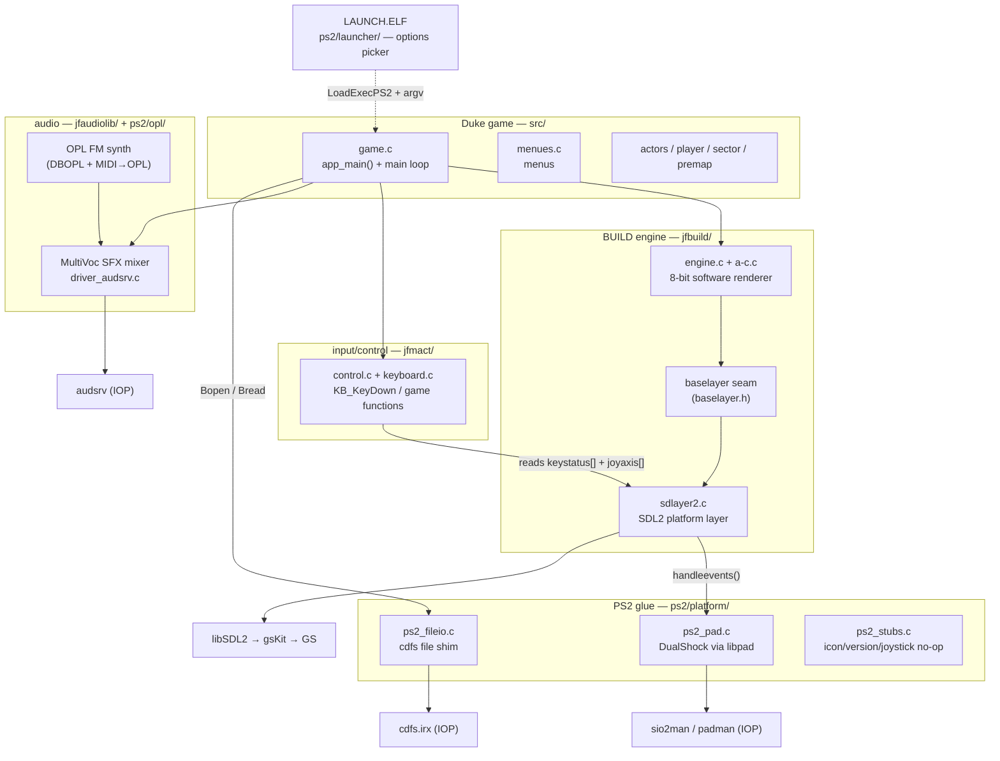
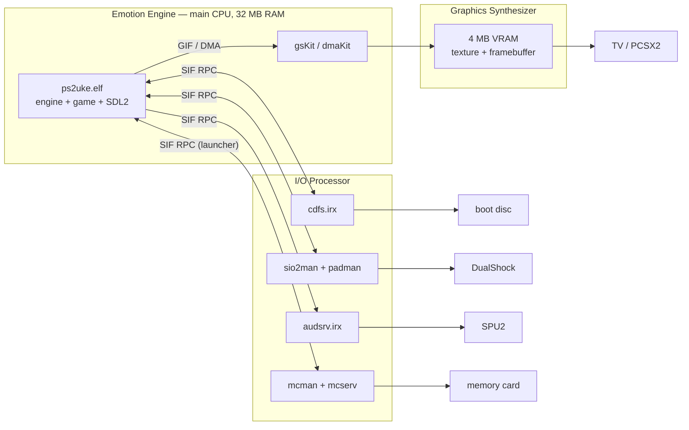
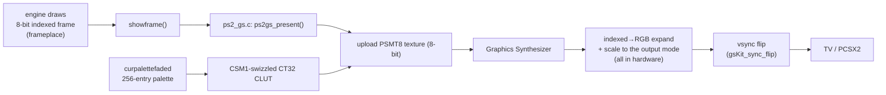
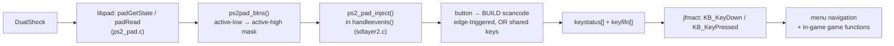
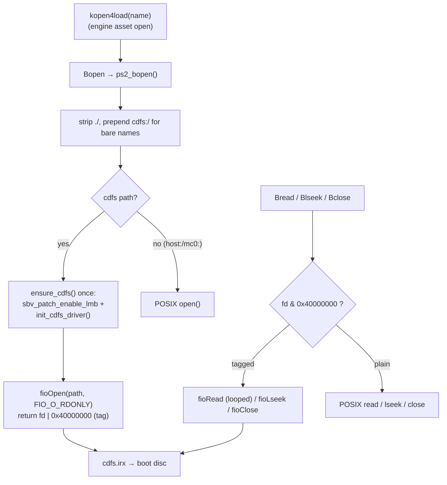
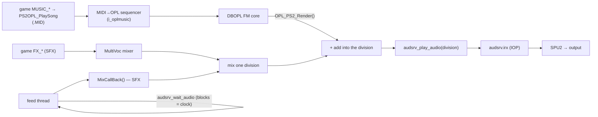
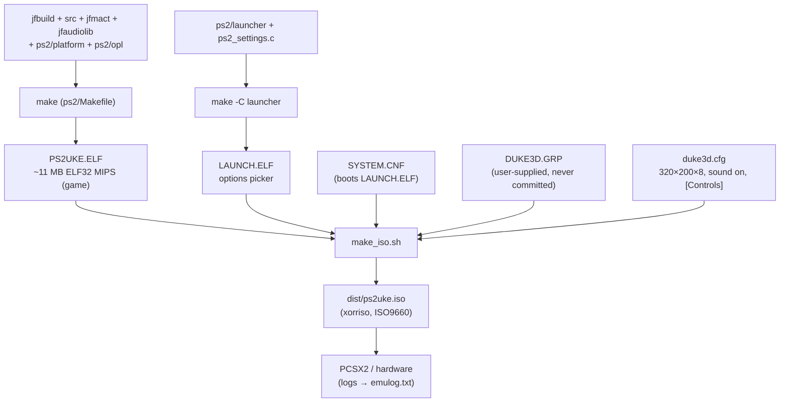

# ps2uke — Architecture

This is the deep-dive companion to [`../PORTING.md`](../PORTING.md). It documents
how the JFDuke3D-on-PlayStation-2 port is wired, subsystem by subsystem, with the
data/control flows drawn out. Everything here is grounded in the actual code; file
and function references are clickable in most editors.

> **Audience:** anyone picking the port up cold. If you only read one diagram,
> read the [Boot sequence](#3-boot-sequence) — it's the spine everything hangs off.

## Table of contents

1. [Overview & module map](#1-overview--module-map)
2. [The two processors (EE / IOP)](#2-the-two-processors-ee--iop)
3. [Boot sequence](#3-boot-sequence)
4. [Video pipeline](#4-video-pipeline)
5. [Input pipeline](#5-input-pipeline)
6. [Filesystem: cdfs & the GRP](#6-filesystem-cdfs--the-grp)
7. [Audio: SFX + OPL music](#7-audio-sfx--opl-music)
8. [Build & ISO](#8-build--iso)
9. [Hard-won facts / gotchas](#9-hard-won-facts--gotchas)
10. [Boot launcher & options](#10-boot-launcher--options)

---

## 1. Overview & module map

ps2uke vendors four upstream trees and adds a thin PS2 glue layer. The engine was
designed to sit behind a **baselayer** seam; the port's job is to implement that
seam (plus filesystem, input and audio) for the console.



| Tree            | Role                                                            | Built as |
|-----------------|----------------------------------------------------------------|----------|
| `jfbuild/`      | BUILD engine + portable **baselayer**; `sdlayer2.c` is the SDL2 seam | software renderer (`USE_POLYMOST=0`, `USE_OPENGL=0`) |
| `src/`          | Duke game logic; `app_main()` in `game.c`                      | game TUs, editor excluded |
| `jfmact/`       | Keyboard/mouse/joystick → game-function mapping                | `control.c`, `keyboard.c`, … |
| `jfaudiolib/`   | Apogee-style MultiVoc mixer + per-OS output drivers            | `driver_audsrv.c` (PS2) |
| `ps2/opl/`      | Software **OPL** FM synth (DBOPL + MIDI→OPL sequencer) for music | lifted from ps2oom |
| `ps2/launcher/` | Standalone boot **options picker** ELF (`LAUNCH.ELF`)          | libpad + libdebug + libmc |
| `ps2/`          | **Our** Makefile, glue (`platform/`), `duke3d.cfg`, ISO builder | links both ELFs |

---

## 2. The two processors (EE / IOP)

A PS2 is two CPUs. The **Emotion Engine (EE)** runs our ELF (engine + game + SDL2)
and drives the **Graphics Synthesizer (GS)** through gsKit. The **I/O Processor
(IOP)** runs small **IRX** modules that own the hardware peripherals; the EE talks
to them over the **SIF** (a DMA + RPC bridge). Getting data on/off the disc, the
pad, and the SPU2 all means an EE→IOP RPC round-trip.



**IRX modules** are loaded from the PS2 ROM (`rom0:SIO2MAN`, `rom0:PADMAN`) or as
buffers embedded in `libps2_drivers` (`cdfs.irx`, `audsrv.irx`). Buffer loading
needs the **SBV patches** enabled first (see boot sequence).

---

## 3. Boot sequence

The disc actually boots **`LAUNCH.ELF`** first (the options picker — see
[§10](#10-boot-launcher--options)); it `LoadExecPS2`'s `PS2UKE.ELF` with the chosen
settings in argv. The sequence below is the *game* ELF's boot.

The single most important wiring decision: **`libSDL2main` owns the entry point.**
Its PS2 `main()` resets the IOP and applies the SBV patches *before* any of our
code, then calls `SDL_main`. We make `sdlayer2.c`'s `main` become that `SDL_main`
with `-Dmain=SDL_main` in the Makefile — otherwise the IOP/SBV bring-up never runs
and `cdfs.irx` fails to register ("Unknown device 'cdfs'").

```mermaid
sequenceDiagram
    autonumber
    participant CRT as crt0 (ELF entry)
    participant MAIN as libSDL2main main()
    participant SDLM as SDL_main = sdlayer2 main()
    participant APP as app_main() — game.c
    participant ST as Startup() — game.c
    participant LOOP as title / menu loop

    CRT->>MAIN: _start
    MAIN->>MAIN: SifInitRpc + IOP reset
    MAIN->>MAIN: sbv_patch_enable_lmb()  (load IRX from EE buffers)
    MAIN->>SDLM: SDL_main(argc, argv)
    SDLM->>SDLM: ps2_settings_apply_argv()  (read "ps2uke=..." from launcher)
    SDLM->>SDLM: SDL_Init(VIDEO | TIMER | GAMECONTROLLER)
    SDLM->>APP: app_main(argc, argv)
    APP->>APP: preinitengine()
    APP->>APP: CONFIG_ReadSetup()      (duke3d.cfg via cdfs)
    APP->>APP: initgroupfile(DUKE3D.GRP)  (lazy cdfs bring-up)
    APP->>ST: Startup()
    ST->>ST: initengine()             (loads PALETTE.DAT)
    ST->>ST: compilecons()            (CON scripts)
    ST->>ST: CONTROL_Startup()        (input)
    ST->>ST: loadpics(tiles000.art)   (ART catalog)
    APP->>APP: setgamemode()          (→ setvideomode → SDL2/gsKit)
    APP->>APP: SoundStartup() / MusicStartup()
    APP->>LOOP: enter loop
    loop every frame
        LOOP->>SDLM: handleevents()   (pad → key events)
        LOOP->>LOOP: draw menu → showframe()
    end
```

Key code anchors: `sdlayer2.c:254` (`main` → `app_main`), `game.c:7675`
(`app_main`), `game.c:7496` (`Startup`).

---

## 4. Video pipeline

The engine renders into an **8-bit palettized framebuffer** (`frameplace`). The
crucial property that makes this portable: **the engine owns the palette**
(`curpalettefaded`) — the platform never pokes hardware palette registers (that's
exactly what dead-ended the Chocolate attempt on the non-existent VESA BIOS).

On PS2 we **bypass SDL2's renderer entirely** and drive the GS directly
(`ps2_gs.c`). `setvideomode()` (`sdlayer2.c:808`) skips `SDL_CreateRenderer` and
calls `ps2gs_init()` instead; each frame `showframe()` (`sdlayer2.c:1064`) hands
the raw 8-bit frame to `ps2gs_present()`, which uploads it as a **GS `PSMT8`
texture** with a **`CT32` CLUT** built from `curpalettefaded`. The **Graphics
Synthesizer does the indexed→RGB expansion *and* the 320×200→640×448 upscale in
hardware** — the EE never touches a pixel after the engine finishes drawing.

This was the single biggest speedup. SDL2's renderer made the EE expand 8→32 and
push a 256 KB RGBA texture *every frame* (slow even on a static logo). Owning the
GS is safe because SDL2's PS2 port only calls `gsKit_init_global` from its
*renderer* — which we skip — so nothing contends for the GS, and SDL2's window +
display/mode enumeration stay intact.



- **Resolution:** the engine renders 320×200×8; the GS upscales the T8 texture to
  the framebuffer. The **boot picker** selects the output mode (`ps2_gs.c` mode
  table): NTSC 480i (640×448, default) / 480p / PAL 576i / 576p (all CT24,
  double-buffered) and **720p** (1280×720, CT16 to fit the 4 MB VRAM). 1080i isn't
  offered — gsKit's interlaced-DTV display setup never produces a picture here.
- **Where the expansion runs:** on the **GS, in hardware** (via the CLUT) — not the
  EE. The EE only `memcpy`s the 8-bit frame into the texture.
- **Frame cap:** `gsKit_sync_flip()` waits for one vsync (~60 fps); the picker's
  "30 fps" option waits a second `gsKit_vsync_wait()`. Single-buffered modes skip
  the flip (just vsync-wait) since there's no second buffer to swap to.
- **VRAM:** the GS has only **4 MB**, shared by the framebuffer(s), our T8 texture
  and the CLUT — which is why ≥720p drops to 16-bit and why 1080i (≈8 MB at CT24)
  doesn't fit at all.

---

## 5. Input pipeline

SDL2's PS2 port ships **no joystick backend**, so `SDL_NumJoysticks()` is always 0
and the engine's `SDL_GameController` path never sees a pad. We bypass it: read the
DualShock with **libpad** directly and inject key events into the same
`keystatus[]` / `keyfifo[]` queue the keyboard would use. This is modelled on
ps2quake's `IN_PadButtons()` — one button→key map serves *both* menus and gameplay,
because Duke's classic bindings already overlap (arrows do menu-nav *and* move/turn).



**Button map** (`ps2_pad_inject` in `sdlayer2.c`):

| Pad            | BUILD key      | Menu          | In-game (Duke default) |
|----------------|----------------|---------------|------------------------|
| D-pad ↑↓←→     | arrows         | navigate      | Move/Turn              |
| ✕ Cross        | Enter `0x1c`   | confirm       | Inventory use          |
| ○ Circle       | Escape `0x01`  | back          | open menu              |
| Start          | Escape `0x01`  | —             | open menu              |
| Select         | Tab `0x0f`     | —             | Map                    |
| □ Square       | Space `0x39`   | —             | Open/Use               |
| △ Triangle     | A `0x1e`       | —             | Jump                   |
| R1 / R2        | LCtrl `0x1d`   | —             | Fire                   |
| L1             | LShift `0x2a`  | —             | Run (hold)             |
| L2             | Z `0x2c`       | —             | Crouch                 |

Pad bring-up is **hang-proof on purpose**: no busy-wait for the pad to go stable
(an unbounded spin is exactly what froze us at `mtapInit`); `ps2pad_btns()` returns
0 until the pad is readable and is retried next frame. DualShock/analog mode is
locked lazily the first time the pad reports stable.

**Analog sticks** are wired through jfmact's joystick path. SDL has no PS2 joystick
backend, so `initinput()` (`sdlayer2.c`) *fakes* one on PS2: it sets
`inputdevices |= 4` and `joynumaxes = 4`, which is exactly what `CONTROL_StartJoy()`
(`== inputdevices & 4`) checks, so jfmact reports a joystick present and enables the
analog axes. Each frame `ps2_pad_inject()` reads the sticks (`ps2pad_sticks()`) and
writes them into jfbuild's `joyaxis[]` (the same array SDL controller-axis events
fill on desktop, in the signed ±32767 range jfmact's deadzone/saturate expect).
`duke3d.cfg [Controls]` maps the axes: left stick = strafe/move, right stick =
turn/look, with the digital sub-axes set to `None` so a stick push doesn't *also*
fire a key.

---

## 6. Filesystem: cdfs & the GRP

All game data lives on the boot disc and is reached through `cdfs.irx`. cdfs is a
**legacy ioman device**: newlib's `open()` can't see it and it rejects
`O_RDONLY == 0`, so disc reads must use the **fio** API (`fioOpen` with
`FIO_O_RDONLY`). jfbuild's `Bopen/Bread/Blseek/Bclose` macros are routed
(in `jfbuild/include/compat.h`) to `ps2_fileio.c`.



**Why the high-bit fd tag?** A descriptor is either a newlib POSIX fd or an fio
handle; `0x40000000` flags the fio ones so `ps2_bread`/`ps2_blseek`/`ps2_bclose`
dispatch correctly. `ps2_bread` **loops** `fioRead` because cdfs can return short,
sector-sized reads while the engine's `kread` expects the exact byte count.

**GRP vs loose files — the fast-fail.** `kopen4load` probes for a loose file on
disc first, then falls back to a byte-range inside the already-open `DUKE3D.GRP`.
A miss is expensive: cdfs scans the disc and PCSX2 emits ~30 "Bad Sector Count
Error" lines (~0.15 s) per failed open — and a level loads dozens of `.voc`/`.mid`
that live *inside* the GRP, so this was the level-load lag and console spam. Our
disc only carries `DUKE3D.GRP` and `DUKE3D.CFG` as loose files, so `ps2_bopen()`
**rejects any other loose `cdfs:` open immediately** (extension allowlist) — no
disc scan; `kopen4load` drops straight to the GRP.

Guarded edits that make cdfs survive the engine's assumptions live in
`compat.c` (`Bfilelength` via seek, since `fstat` fails on a tagged fd),
`cache1d.c` and `jfmact/file_lib.c` (raw `read/lseek/close` re-routed to the shim;
failed opens made non-fatal so a missing optional file can't abort boot).

---

## 7. Audio: SFX + OPL music

Both sound effects and music play, through a single PS2 `audsrv` stream.

**SFX** use a native **audsrv** driver for jfaudiolib (`driver_audsrv.c`), modelled
on ps2quake's `snd_ps2.c`. MultiVoc mixes into a buffer split into divisions; a
dedicated, higher-priority EE **feed thread** streams one division at a time to
`audsrv_play_audio`, self-pacing on the blocking `audsrv_wait_audio` (which *is* the
audio clock). The IOP audio modules come up via `init_audio_driver()`
(libps2_drivers). It slots into jfaudiolib as `ASS_AudSrv`, which `FX_Init(
ASS_AutoDetect, …)` selects (the only PCM driver built).

**Music** is a software **OPL** (Yamaha FM) synth in `ps2/opl/`, lifted from ps2oom:
the DOSBox `dbopl` core plus Chocolate-Doom's MIDI→OPL sequencer (`i_oplmusic`,
`midifile`, `opl_queue`). Duke's `playmusic()` hands the raw `.MID` straight to
`PS2OPL_PlaySong` — **bypassing jfaudiolib's own MIDI sequencer** — and the feed
thread pulls a chunk of synthesized music via `OPL_PS2_Render()` and **mixes it into
the same division** as the SFX before pushing it. So one blocking `audsrv` stream
carries both, and the OPL clock is paced by playback. GENMIDI is embedded
(`demo_genmidi.c`); a tiny `opl_shim.h` + stub headers de-couple the lifted sources
from the Doom tree.



The jfaudiolib PCM driver interface (`driver_audsrv.h`): `PCM_Init`,
`PCM_BeginPlayback(buffer, size, divisions, callback)`, `PCM_StopPlayback`,
`PCM_Lock/Unlock`. The music boost/volume is one of the boot-picker options.

---

## 8. Build & ISO

The ps2dev toolchain runs in Docker (image `ps2uke-dock:local`, GCC 15.2.0,
`mips64r5900el-ps2-elf`, n32 ABI). The ELF is assembled from the four trees plus
`ps2/platform/`; `make_iso.sh` stages a bootable ISO9660.



```sh
./build.sh                 # ps2/ps2uke.elf (game) + ps2/launcher/launcher.elf
./make_iso.sh [grp-dir]    # → dist/ps2uke.iso (LAUNCH.ELF + PS2UKE.ELF + GRP + cfg)
```

`build.sh` runs both makes (the game, then `make -C launcher`). The disc boots
`LAUNCH.ELF`, which chain-loads `PS2UKE.ELF`. The emulator is **never auto-launched**
from the toolchain; build the artifact and stop. PCSX2's stdout isn't reachable from
WSL, so runtime verification reads `emulog.txt` (and enable **Fast Boot** to skip the
~14 s BIOS intro).

---

## 9. Hard-won facts / gotchas

- **n32 ABI:** on the EE, `long` and pointers are 32-bit and `int32_t` is `long`,
  not `int`. Endianness is **little**; jfbuild needed an explicit PS2 branch
  (`B_LITTLE_ENDIAN`).
- **`-Dmain=SDL_main` is load-bearing.** Without it, `libSDL2main`'s IOP-reset +
  SBV-patch entry never runs and cdfs can't register.
- **`mtapInit` deadlock.** `libps2_drivers`' `init_joystick_driver()` spins forever
  on the unloaded `mtapman` module under PCSX2. We override it to a **no-op** and
  do pad I/O ourselves with libpad. Likewise, **never busy-wait** on pad state.
- **`Bfilelength` on a tagged cdfs fd:** `fstat` fails → it must measure length by
  seeking (`SEEK_END`), or a `malloc(0)` + over-read corrupts memory (we hit a TLB
  miss at the top of RAM, `0x02000000`).
- **Palette truncation:** `cache1d`'s raw `read/lseek` had to be routed through the
  cdfs shim or `PALETTE.DAT` loaded short. Do **not** redirect `write` (the disc is
  read-only; it created a macro cycle).
- **Demo version mismatch is expected.** `Demo demo1.dmo is of an incompatible
  version (117)` — the Atomic GRP's attract demos are the original engine's format;
  JFDuke3D records/plays its own and skips them. Not a bug.
- **Memory:** 32 MB EE RAM, top at `0x02000000`. The ELF is ~11 MB; the GRP is
  streamed off disc, not loaded whole.
- **The picker had to be its own ELF.** A first attempt drew the options menu
  inside the game ELF; it fought the engine on two fronts — `init_scr()` (libdebug)
  vs gsKit both wanting the GS, and a second `padPortOpen()` left the pad unstable
  so in-game input died. Splitting it into `LAUNCH.ELF` (which `padEnd()`s and hands
  off the whole machine) fixed both, exactly as ps2quake/ps2oom do it.
- **Quit must not `exit(0)`.** Returning from `main`/`exit()` deadlocks tearing down
  the IOP (audsrv/cdfs) — "callnull" spam. Quit instead resets the IOP and
  `LoadExecPS2`'s the launcher (`ps2_reboot.c`); fatal errors use the Exit syscall.
  An IOP reset before `LoadExecPS2` must **re-init RPC + LoadFile** (`SifInitRpc` +
  `SifLoadFileInit`) afterwards, or the re-exec has no RPC and black-screens.
- **The boot delay is the BIOS, not USB/dev9.** The ~14 s before the picker is
  PCSX2 playing the BIOS intro with Fast Boot off — the emulog shows
  `init_cdfs_driver()` completing fast with no USB/dev9 stall, so (unlike ps2oom) we
  do **not** stub `waitUntilDeviceIsReady`/USB/dev9 — they're left intact for future
  USB/HDD data loading.
- **4 MB VRAM caps resolution.** 720p fits only at 16-bit; 1080i (≈8 MB at CT24,
  ~5.5 MB even CT16 double-buffered) doesn't fit, and gsKit's interlaced-DTV display
  setup didn't come up regardless — so 720p is the ceiling. Single-buffered modes
  must skip `gsKit_sync_flip` (no second buffer) and just `gsKit_vsync_wait`.

---

## 10. Boot launcher & options

`SYSTEM.CNF` boots **`LAUNCH.ELF`** (`ps2/launcher/`) — a small standalone ELF
(libpad + libdebug + libmc, no SDL/engine) that shows the PS2 options picker and
then `LoadExecPS2`'s the game. This is the ps2quake/ps2oom launcher model.

```mermaid
sequenceDiagram
    autonumber
    participant CNF as SYSTEM.CNF
    participant L as LAUNCH.ELF (launcher_main.c)
    participant MC as memory card (libmc)
    participant G as PS2UKE.ELF (the game)

    CNF->>L: boot
    L->>L: SifLoadModule SIO2MAN/PADMAN/MCMAN/MCSERV
    L->>L: init_scr() (libdebug text screen)
    L->>MC: ps2_settings_load()  (mc0:→mc1:, or defaults)
    L->>L: picker loop — d-pad / Left-Right (libpad)
    L->>MC: ps2_settings_save()  (best-effort)
    L->>L: padPortClose / padEnd
    L->>G: LoadExecPS2("cdrom0:\\PS2UKE.ELF;1", "ps2uke=v.f.c.m")
    Note over G: ps2_settings_apply_argv() before SDL_Init
    Note over G,L: in-game Quit → ps2_reboot() → LoadExecPS2(LAUNCH.ELF)
```

- **Options** (`ps2_settings_t`): video mode (480i/480p/576i/576p/720p), texture
  filter (sharp/smooth), frame cap (60/30), music level. The game reads them via
  `ps2cfg` — `ps2_gs.c` for video, `driver_audsrv.c` for music gain.
- **Hand-off two ways.** Settings ride to the game in an argv tag (`ps2uke=v.f.c.m`,
  parsed by `ps2_settings_apply_argv` before `SDL_Init` so the video mode is set
  before the GS comes up) **and** persist to `mc?:/PS2UKE/SETTINGS.BIN` via libmc's
  async API (`mcGetInfo`/`mcOpen`/`mcRead`/`mcWrite` + blocking `mcSync`). No card →
  RAM-only for the session; the argv tag still applies. `ps2_settings.c` is the one
  file shared between the launcher and game ELFs.
- **Safety:** if no controller becomes readable the picker times out and launches
  with the loaded/default settings, so it can't hang.
